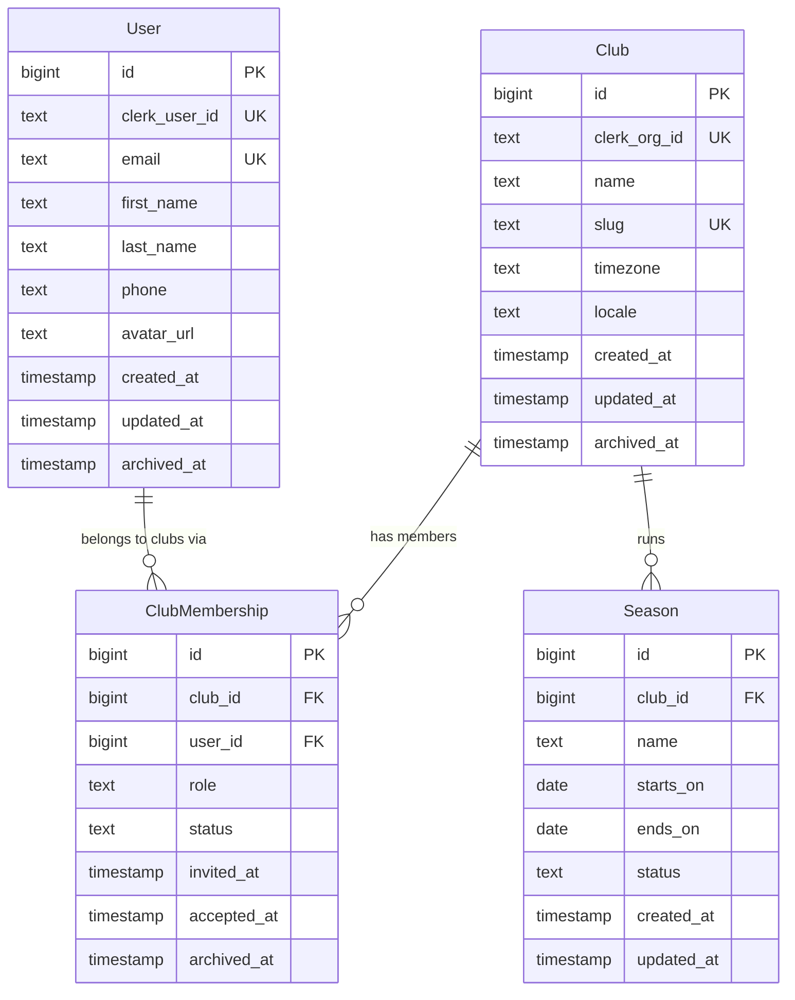

# Data Model — Base Entities

Phase 0 documents the four foundational entities that every Phase 1+ module builds on. Module-specific entities (Team, Tryout, Player, Practice, Payment, etc.) are documented in their per-phase wiki pages and implemented via per-phase Knex migrations. They are referenced here only as forward-looking FK targets.

---

## ER Diagram



---

## Naming Conventions

- Tables: plural, snake_case — `clubs`, `users`, `club_memberships`, `seasons`
- Columns: snake_case — `created_at`, `clerk_org_id`, `first_name`
- Primary key: `id` (bigint, auto-increment) on every table
- Timestamps: `*_at` suffix (timestamp without timezone, stored as UTC)
- Soft-delete column: `archived_at` (timestamp, nullable) — `NULL` means active
- All queries at the repository layer default to `WHERE archived_at IS NULL` unless the caller explicitly opts in to archived rows (e.g., for history views)
- Enum-like columns: stored as `text` with a `CHECK` constraint or a lookup table (RDBMS-portable). No Postgres `ENUM` type.

---

## Multi-Tenant Strategy

Every entity that belongs to a club carries a `club_id` FK. The service layer is responsible for scoping all reads and writes by `club_id`. This is enforced by convention (code review) — the project does not rely on Postgres RLS, which is not portable to SQLite or MySQL (per ADR-002).

Pattern in the repository layer:

```ts
// Always include club_id in WHERE — service passes it from the authenticated JWT claim
const seasons = await knex('seasons')
  .where({ club_id: clubId, archived_at: null })
  .orderBy('starts_on', 'desc');
```

The authenticated user's `club_id` context comes from the Clerk JWT: the Clerk Organization ID is resolved to the internal `Club.id` once (at middleware time) and threaded through the request context. No endpoint accepts `club_id` from the request body — it is always derived from the auth token.

---

## Clerk Sync Model

Clerk is the identity authority. Our database holds a denormalized, searchable shadow of Clerk's state. Synchronization is event-driven via Clerk webhooks.

### Webhook handler shape (Phase 1 implements — documented here for contract)

| Clerk event | Handler action |
|---|---|
| `user.created` | INSERT into `users` (clerk_user_id, email, first_name, last_name, avatar_url) |
| `user.updated` | UPDATE `users` WHERE clerk_user_id = ? (email, first_name, last_name, avatar_url) |
| `user.deleted` | SET archived_at = NOW() on `users` WHERE clerk_user_id = ? |
| `organization.created` | INSERT into `clubs` (clerk_org_id, name, slug derived from name) |
| `organization.updated` | UPDATE `clubs` WHERE clerk_org_id = ? (name) |
| `organization.deleted` | SET archived_at = NOW() on `clubs` WHERE clerk_org_id = ? |
| `organizationMembership.created` | INSERT into `club_memberships` (club_id, user_id, role from Clerk metadata, status = 'active') |
| `organizationMembership.updated` | UPDATE `club_memberships` role/status WHERE (club_id, user_id) |
| `organizationMembership.deleted` | SET archived_at = NOW() on `club_memberships` WHERE (club_id, user_id) |

Webhook endpoint: `POST /api/webhooks/clerk` — validates signature using `CLERK_WEBHOOK_SECRET` (svix signature verification). This secret must be set in `.env` before the webhook handler is deployed.

The `User.email` and `User.avatar_url` fields are denormalized from Clerk purely for fast DB lookups (e.g., search, notification address resolution) without round-tripping to the Clerk API. Clerk remains the system of record.

---

## Entity: Club

**Purpose:** Represents a single AAU club — the top-level tenant. One row per club; all other data scopes to it.

### Fields

| Column | Type | Nullable | Default | Notes |
|---|---|---|---|---|
| `id` | bigint | NO | auto-increment | Internal PK |
| `clerk_org_id` | text | NO | — | Clerk Organization ID; source of truth for auth membership |
| `name` | text | NO | — | Display name (e.g., "Metro Ballers AAU") |
| `slug` | text | NO | — | URL-safe identifier (e.g., "metro-ballers"); used in routing |
| `timezone` | text | NO | `'America/New_York'` | IANA timezone string; used for season/schedule display |
| `locale` | text | NO | `'en-US'` | BCP-47 locale; used for date/number formatting |
| `created_at` | timestamp | NO | `NOW()` | UTC |
| `updated_at` | timestamp | NO | `NOW()` | UTC; updated by Knex hook on every write |
| `archived_at` | timestamp | YES | NULL | Soft-delete; NULL = active |

### Indexes

| Name | Columns | Type | Purpose |
|---|---|---|---|
| `clubs_pkey` | `id` | PRIMARY KEY | — |
| `clubs_clerk_org_id_uk` | `clerk_org_id` | UNIQUE | Fast Clerk webhook lookup |
| `clubs_slug_uk` | `slug` | UNIQUE | URL routing uniqueness |
| `clubs_archived_at_idx` | `archived_at` | INDEX | Filter active clubs (partial index where supported) |

### Foreign keys

- No FKs in (root entity)
- FKs out: none at this entity
- FKs into Club from other tables: `club_memberships.club_id`, `seasons.club_id`, and all Phase 1+ module entities

### Soft-delete behavior

Setting `archived_at` deactivates the club. All child entities (seasons, memberships, etc.) remain in place; they are not cascade-archived. This preserves history. Active-only queries at the service layer append `WHERE archived_at IS NULL`.

---

## Entity: User

**Purpose:** Represents a person who has authenticated via Clerk. One row per person regardless of how many clubs they belong to.

### Fields

| Column | Type | Nullable | Default | Notes |
|---|---|---|---|---|
| `id` | bigint | NO | auto-increment | Internal PK |
| `clerk_user_id` | text | NO | — | Clerk User ID; JWT `sub` claim |
| `email` | text | NO | — | Denormalized from Clerk; kept in sync via webhook |
| `first_name` | text | NO | — | — |
| `last_name` | text | NO | — | — |
| `phone` | text | YES | NULL | E.164 format (e.g., `+12125551234`); nullable — not all users provide |
| `avatar_url` | text | YES | NULL | Clerk-hosted avatar URL; denormalized |
| `created_at` | timestamp | NO | `NOW()` | UTC |
| `updated_at` | timestamp | NO | `NOW()` | UTC |
| `archived_at` | timestamp | YES | NULL | Soft-delete; NULL = active |

### Indexes

| Name | Columns | Type | Purpose |
|---|---|---|---|
| `users_pkey` | `id` | PRIMARY KEY | — |
| `users_clerk_user_id_uk` | `clerk_user_id` | UNIQUE | JWT resolution; webhook lookup |
| `users_email_uk` | `email` | UNIQUE | Notification address lookup; login hint |
| `users_archived_at_idx` | `archived_at` | INDEX | Filter active users |

### Foreign keys

- No FKs in (root identity entity)
- FKs into User: `club_memberships.user_id`

### Notes

- No password column. Clerk owns all credentials (password, OAuth tokens, MFA). Our `User` is a profile shadow only.
- `email` is synchronized on every `user.updated` webhook. If Clerk allows email change, the webhook fires and we update the row. There is a brief window of inconsistency between the Clerk event and our write — this is acceptable for MVP; Phase 5 can add optimistic locking if needed.
- `phone` is stored as E.164. WhatsApp (360dialog) sends require E.164. If a user registers via Clerk without a phone number, `phone` stays NULL and WhatsApp notifications are suppressed for that user (notification service checks before enqueuing).

---

## Entity: ClubMembership

**Purpose:** Join between User and Club, with a role and lifecycle status. Supports a user belonging to multiple clubs with different roles per club.

### Fields

| Column | Type | Nullable | Default | Notes |
|---|---|---|---|---|
| `id` | bigint | NO | auto-increment | Internal PK |
| `club_id` | bigint | NO | — | FK → clubs.id |
| `user_id` | bigint | NO | — | FK → users.id |
| `role` | text | NO | — | `director` \| `coach` \| `parent` \| `player` — CHECK constraint |
| `status` | text | NO | `'invited'` | `invited` \| `active` \| `suspended` — CHECK constraint |
| `invited_at` | timestamp | NO | `NOW()` | When the invitation was created |
| `accepted_at` | timestamp | YES | NULL | When the user accepted; NULL if still invited |
| `archived_at` | timestamp | YES | NULL | Soft-delete; NULL = active member |

### Indexes

| Name | Columns | Type | Purpose |
|---|---|---|---|
| `club_memberships_pkey` | `id` | PRIMARY KEY | — |
| `club_memberships_club_user_uk` | `(club_id, user_id)` | UNIQUE | One membership row per user per club |
| `club_memberships_club_id_idx` | `club_id` | INDEX | Enumerate members of a club |
| `club_memberships_user_id_idx` | `user_id` | INDEX | Find all clubs a user belongs to |
| `club_memberships_role_idx` | `(club_id, role)` | INDEX | List all coaches in a club, etc. |

### Foreign keys

| Column | References | On delete |
|---|---|---|
| `club_id` | `clubs.id` | RESTRICT (do not delete club with active memberships) |
| `user_id` | `users.id` | RESTRICT |

### Role semantics

| Role | Description |
|---|---|
| `director` | Club-wide admin; creates seasons, manages all teams and coaches |
| `coach` | Assigned to one or more teams; manages practice/roster for own teams |
| `parent` | Linked to one or more players via Phase 1 `ParentChildLink`; view + notification target |
| `player` | The athlete; view-only access to own team/schedule |

One `ClubMembership` row grants a single role per club. A user who is both a coach and a parent at the same club (common in youth sports) has a single `ClubMembership` with role `coach` — the higher-privilege role takes precedence. If fine-grained dual-role is needed in a future phase, add a `club_membership_roles` junction table (additive, non-breaking migration).

### Status transitions

```
invited → active     (user accepts invitation via Clerk flow)
active  → suspended  (director suspends membership)
suspended → active   (director reinstates)
any     → archived   (soft-delete; membership ends)
```

---

## Entity: Season

**Purpose:** A bounded period of club operations (e.g., "Spring 2026"). Most Phase 1+ entities — Teams, Tryouts, Practices, Payments — scope to a Season.

### Fields

| Column | Type | Nullable | Default | Notes |
|---|---|---|---|---|
| `id` | bigint | NO | auto-increment | Internal PK |
| `club_id` | bigint | NO | — | FK → clubs.id |
| `name` | text | NO | — | Human label (e.g., "Spring 2026", "Fall 2026") |
| `starts_on` | date | NO | — | Inclusive start date (date, not timestamp) |
| `ends_on` | date | NO | — | Inclusive end date |
| `status` | text | NO | `'upcoming'` | `upcoming` \| `active` \| `archived` — CHECK constraint |
| `created_at` | timestamp | NO | `NOW()` | UTC |
| `updated_at` | timestamp | NO | `NOW()` | UTC |

### Indexes

| Name | Columns | Type | Purpose |
|---|---|---|---|
| `seasons_pkey` | `id` | PRIMARY KEY | — |
| `seasons_club_id_idx` | `club_id` | INDEX | All seasons for a club |
| `seasons_club_status_idx` | `(club_id, status)` | INDEX | Find active season for a club (hot path) |

### Foreign keys

| Column | References | On delete |
|---|---|---|
| `club_id` | `clubs.id` | RESTRICT |

### Notes

- No `archived_at` column — Season uses `status = 'archived'` as its end state. Once a season ends it transitions to `archived` rather than being soft-deleted, because historical data (past seasons' rosters, payments, tournament records) must remain queryable.
- At most one Season per Club should have `status = 'active'` at a time. This is enforced in the service layer (not a DB constraint) because the transition is business logic: a director explicitly activates a new season, which archives the current one.
- `starts_on` / `ends_on` are `date` type (not timestamp) because season boundaries are calendar-day concepts, interpreted in the Club's `timezone`.

### Status transitions

```
upcoming → active    (director activates — archives the previously active season if any)
active   → archived  (director closes the season, or automatic at ends_on)
upcoming → archived  (director cancels a planned season without activating it)
```

---

## Phase 1+ FK Forward Look

The following entities will be added in Phase 1 and beyond. They FK back to the base entities above. Listed here so migration authors know the target columns.

| Future entity | Table | FK column → target |
|---|---|---|
| Team | `teams` | `club_id → clubs.id`, `season_id → seasons.id` |
| TeamCoach | `team_coaches` | `team_id → teams.id`, `user_id → users.id` |
| Tryout | `tryouts` | `club_id → clubs.id`, `season_id → seasons.id` |
| TryoutRegistration | `tryout_registrations` | `tryout_id → tryouts.id`, `user_id → users.id` (parent) |
| Player | `players` | `club_id → clubs.id`, `user_id → users.id` (nullable — player may not have Clerk account at tryout time) |
| ParentChildLink | `parent_child_links` | `parent_user_id → users.id`, `player_id → players.id` |
| RosterEntry | `roster_entries` | `team_id → teams.id`, `player_id → players.id`, `season_id → seasons.id` |
| Practice | `practices` | `team_id → teams.id`, `season_id → seasons.id` |
| Gym | `gyms` | `club_id → clubs.id` |
| PracticeGymBooking | `practice_gym_bookings` | `practice_id → practices.id`, `gym_id → gyms.id` |
| JerseyOrder | `jersey_orders` | `club_id → clubs.id`, `season_id → seasons.id` |
| PaymentRecord | `payment_records` | `club_id → clubs.id`, `season_id → seasons.id`, `user_id → users.id` |
| TournamentEntry | `tournament_entries` | `club_id → clubs.id`, `season_id → seasons.id`, `team_id → teams.id` |

All future entities inherit the multi-tenant scoping rule: `club_id` is present wherever ownership by a club is required.

---

## Sample Seed Data (local dev)

One club, one director, one season — enough to boot the app locally and exercise the auth scaffold.

```ts
// server/db/seeds/00_base.ts  (Knex seed file — devs write this in Phase 1)

// Club
{ id: 1, clerk_org_id: 'org_test_placeholder', name: 'Metro Ballers AAU',
  slug: 'metro-ballers', timezone: 'America/Chicago', locale: 'en-US' }

// User
{ id: 1, clerk_user_id: 'user_test_placeholder', email: 'director@example.com',
  first_name: 'Alex', last_name: 'Rivera', phone: null, avatar_url: null }

// ClubMembership
{ id: 1, club_id: 1, user_id: 1, role: 'director', status: 'active',
  invited_at: NOW(), accepted_at: NOW() }

// Season
{ id: 1, club_id: 1, name: 'Spring 2026', starts_on: '2026-03-01',
  ends_on: '2026-05-31', status: 'active' }
```

Replace `clerk_org_id` and `clerk_user_id` with values from your local Clerk dev application after running the auth scaffold (TASK-006/009).

---

## Sample Repository Queries (Knex — multi-tenant pattern)

```ts
// Always scope by club_id — never query without it
// Example: list active seasons for a club

const seasons = await knex('seasons')
  .where({ club_id: clubId, status: 'active' })
  .orderBy('starts_on', 'desc');

// Example: list active coaches in a club

const coaches = await knex('club_memberships as cm')
  .join('users as u', 'u.id', 'cm.user_id')
  .where({ 'cm.club_id': clubId, 'cm.role': 'coach', 'cm.archived_at': null })
  .whereNull('u.archived_at')
  .select('u.id', 'u.first_name', 'u.last_name', 'u.email', 'cm.status');
```

The `club_id` always comes from the auth middleware (resolved from Clerk JWT `org_id` claim → `clubs.clerk_org_id` → `clubs.id`). It is never trusted from request parameters.

---

## Why Module-Specific Entities Are Out of Scope Here

Entities like Team, Player, Practice, and Payment will be documented in their respective per-phase wiki pages (`docs/wiki/module-*.md`) and implemented via per-phase Knex migrations. Bundling them here would couple this foundation document to phase-specific decisions that will evolve through Gates 1 and 2 for each phase. The four base entities above are stable enough to document now; everything else waits for the approved PDD of the phase that introduces it.
